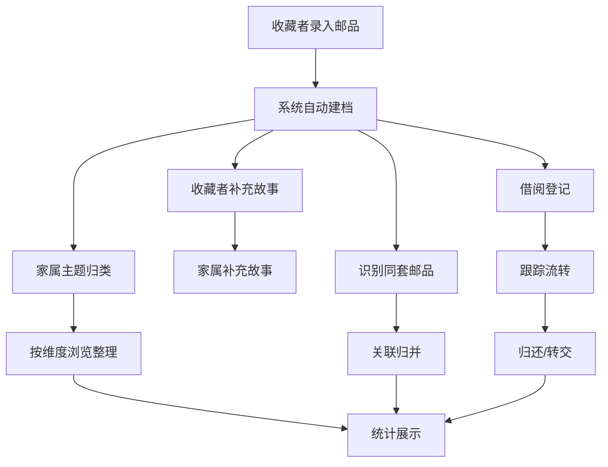

## 1. 产品概述

家庭集邮档案与主题整理协同平台——帮助社区老人和家庭系统化地管理邮票、封片和纪念册收藏，记录每件邮品的发行信息、来源故事和纪念意义，支持按人物、节日、城市、历史事件等主题归类，并跟踪借阅展示与保管转交情况，解决散落不同册页的同套邮品关联归并问题。

- 目标用户：集邮爱好者（以老年人为主）、其家属与晚辈
- 核心价值：让家庭集邮收藏从"混放难辨"变为"有档可查、有题可循、有迹可追"

## 2. 核心功能

### 2.1 用户角色

| 角色 | 注册方式 | 核心权限 |
|------|----------|----------|
| 收藏者（老人） | 邀请码注册 | 建档、补充故事、查看统计 |
| 家属 | 邀请码注册 | 主题归类、借阅登记、关联归并、查看统计 |
| 访客 | 无需注册 | 仅查看公开邮品档案 |

### 2.2 功能模块

1. **邮品档案页**：邮品列表、新建/编辑邮品、关联归并、筛选与搜索
2. **主题整理页**：主题分类管理、邮品归类、按维度（人物/节日/城市/历史事件）浏览
3. **来源故事页**：故事列表、补充背景故事、交换经历与纪念意义记录
4. **借阅流转页**：借阅登记、归还确认、保管转交记录、流转历史
5. **统计页**：题材占比、待整理册页数、高频纪念主题、保管分布

### 2.3 页面详情

| 页面名称 | 模块名称 | 功能描述 |
|----------|----------|----------|
| 邮品档案 | 邮品列表 | 展示所有邮品卡片，含缩略图、名称、年份、状态标签；支持搜索与多维筛选 |
| 邮品档案 | 新建/编辑邮品 | 表单录入发行年份、题材主题、保存状态、来源、所属册页、关联套组 |
| 邮品档案 | 关联归并 | 同套邮品散落不同册页时，按套组关联展示，支持一键归并到同一册页 |
| 主题整理 | 主题分类 | 按人物、节日、城市、历史事件等维度管理主题标签 |
| 主题整理 | 邮品归类 | 拖拽或选择将邮品归入对应主题，支持一邮多主题 |
| 主题整理 | 主题浏览 | 按主题维度浏览邮品集合，查看主题下邮品数量和详情 |
| 来源故事 | 故事列表 | 展示所有邮品关联的故事，含作者、时间线、故事类型标签 |
| 来源故事 | 补充故事 | 老人补充当年购买背景、交换经历和特别纪念意义；家属也可补充 |
| 借阅流转 | 借阅登记 | 登记借出人、借出时间、预计归还、用途（展览/交流等） |
| 借阅流转 | 归还确认 | 确认归还、记录归还时保存状态变化 |
| 借阅流转 | 保管转交 | 登记保管人变更、转交原因、转交时状态检查 |
| 统计 | 题材占比 | 饼图/环形图展示各题材主题的邮品数量占比 |
| 统计 | 待整理册页 | 显示尚未完成主题归类的册页和邮品数量 |
| 统计 | 高频纪念主题 | 排行榜展示被引用最多的纪念主题 |
| 统计 | 保管分布 | 展示邮品在家庭成员间的保管分布情况 |

## 3. 核心流程

1. **建档流程**：收藏者录入邮品基本信息（年份/题材/状态/来源）→ 系统自动建档 → 家属补充主题归类
2. **故事补充流程**：收藏者打开邮品详情 → 点击"补充故事" → 填写购买背景/交换经历/纪念意义 → 保存关联到邮品
3. **关联归并流程**：家属搜索同套邮品 → 识别散落不同册页的邮品 → 创建/加入套组 → 一键归并到同一册页
4. **借阅流转流程**：登记借出 → 跟踪借出状态 → 归还确认/保管转交 → 更新保管人和状态

## 4. 用户界面设计

### 4.1 设计风格

- 主色调：深琥珀色 (#B8860B) 搭配暖米色背景 (#FDF6E3)，呼应邮票的古典与收藏质感
- 辅助色：深棕 (#5C3A1E) 用于文本和边框，墨绿 (#2D5016) 用于状态标签
- 按钮：圆角微凸起风格，带细微阴影，hover 时加深
- 字体：标题使用 "Noto Serif SC"（宋体韵味），正文使用 "Noto Sans SC"
- 布局：左侧固定导航栏 + 右侧内容区，卡片式展示
- 图标：lucide-react 图标库，线性风格

### 4.2 页面设计概览

| 页面名称 | 模块名称 | UI元素 |
|----------|----------|--------|
| 邮品档案 | 邮品列表 | 网格卡片布局，每卡片含邮票图案占位、名称、年份徽章、状态标签、所属册页 |
| 邮品档案 | 新建/编辑表单 | 模态框表单，分步录入基本信息和详细信息 |
| 邮品档案 | 关联归并 | 侧边抽屉展示套组关系图，支持拖拽归并 |
| 主题整理 | 主题分类 | 左侧主题树 + 右侧邮品网格，主题节点含计数徽章 |
| 主题整理 | 主题浏览 | 瀑布流展示主题下邮品，顶部主题统计摘要 |
| 来源故事 | 故事列表 | 时间线布局，故事卡片含作者头像、时间、类型图标 |
| 来源故事 | 补充故事 | 底部滑入面板，富文本编辑 |
| 借阅流转 | 流转列表 | 表格布局，状态列含彩色圆点指示，操作列含快捷按钮 |
| 借阅流转 | 登记/确认 | 模态框表单，含日期选择器和人员选择 |
| 统计 | 统计面板 | 四象限布局，含饼图、柱状图、排行榜、分布图 |

### 4.3 响应式设计

- 桌面优先，最小宽度 1024px
- 平板端（768-1024px）导航栏折叠为底部标签栏
- 移动端（< 768px）单列布局，卡片全宽

## 5. 非功能性需求

- 前端端口：9411，后端端口：9412
- 数据存储：SQLite（轻量级，适合家庭使用场景）
- 响应时间：页面加载 < 2s，API 响应 < 500ms
