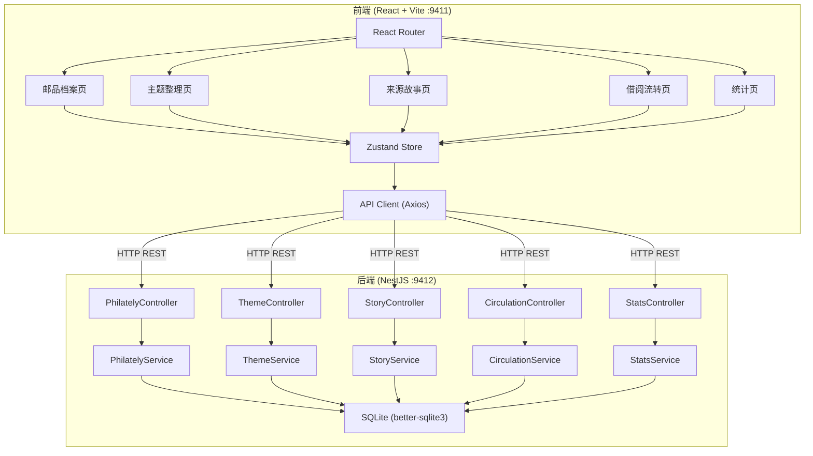
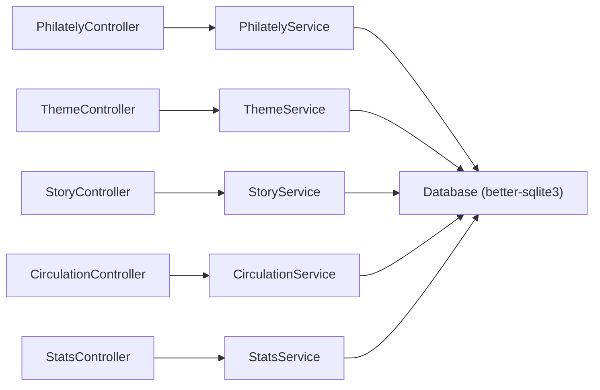
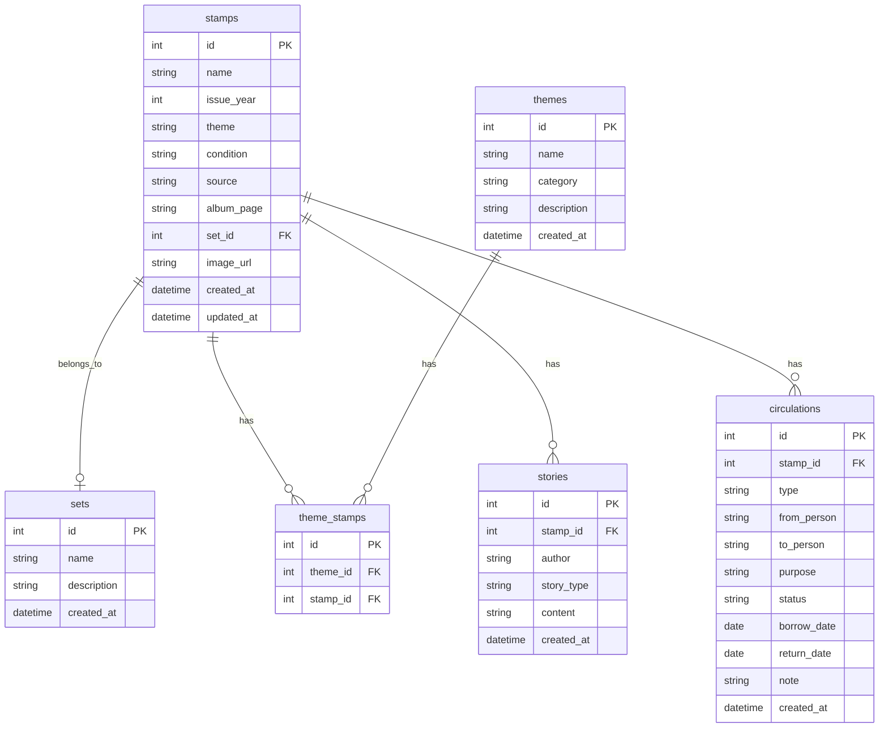

## 1. 架构设计



## 2. 技术说明

- **前端**：React@18 + TypeScript + Tailwind CSS@3 + Vite + Zustand + React Router@6 + Recharts（图表）
- **初始化工具**：vite-init
- **后端**：NestJS + TypeScript + better-sqlite3
- **数据库**：SQLite（文件存储，零配置部署）
- **端口**：前端 9411，后端 9412

## 3. 路由定义

| 路由 | 用途 |
|------|------|
| `/` | 重定向到邮品档案页 |
| `/archive` | 邮品档案页 - 邮品列表与建档 |
| `/archive/:id` | 邮品详情页 |
| `/themes` | 主题整理页 - 主题分类与邮品归类 |
| `/stories` | 来源故事页 - 故事列表与补充 |
| `/circulation` | 借阅流转页 - 借阅登记与流转跟踪 |
| `/stats` | 统计页 - 各维度数据统计展示 |

## 4. API定义

### 4.1 邮品档案 API

```typescript
interface StampItem {
  id: number;
  name: string;
  issueYear: number;
  theme: string;
  condition: "完好" | "轻微损伤" | "明显损伤" | "严重损伤";
  source: string;
  albumPage: string;
  setId: number | null;
  imageUrl: string | null;
  createdAt: string;
  updatedAt: string;
}

// GET    /api/stamps          - 获取邮品列表（支持查询参数筛选）
// GET    /api/stamps/:id      - 获取邮品详情
// POST   /api/stamps          - 新建邮品
// PUT    /api/stamps/:id      - 更新邮品
// DELETE /api/stamps/:id      - 删除邮品
// POST   /api/stamps/merge    - 关联归并同套邮品

interface StampQuery {
  keyword?: string;
  theme?: string;
  issueYear?: number;
  condition?: string;
  albumPage?: string;
  setId?: number;
}

interface MergeRequest {
  stampIds: number[];
  targetAlbumPage: string;
}
```

### 4.2 主题整理 API

```typescript
interface Theme {
  id: number;
  name: string;
  category: "人物" | "节日" | "城市" | "历史事件" | "其他";
  description: string;
  stampCount: number;
  createdAt: string;
}

interface ThemeStamp {
  id: number;
  themeId: number;
  stampId: number;
}

// GET    /api/themes           - 获取主题列表
// GET    /api/themes/:id       - 获取主题详情（含关联邮品）
// POST   /api/themes           - 新建主题
// PUT    /api/themes/:id       - 更新主题
// DELETE /api/themes/:id       - 删除主题
// POST   /api/themes/:id/stamps - 为主题添加邮品
// DELETE /api/themes/:id/stamps/:stampId - 从主题移除邮品
```

### 4.3 来源故事 API

```typescript
interface Story {
  id: number;
  stampId: number;
  author: string;
  storyType: "购买背景" | "交换经历" | "纪念意义" | "其他";
  content: string;
  createdAt: string;
}

// GET    /api/stories          - 获取故事列表（支持按邮品筛选）
// GET    /api/stories/:id      - 获取故事详情
// POST   /api/stories          - 新建故事
// PUT    /api/stories/:id      - 更新故事
// DELETE /api/stories/:id      - 删除故事
```

### 4.4 借阅流转 API

```typescript
interface Circulation {
  id: number;
  stampId: number;
  type: "借出" | "归还" | "转交";
  fromPerson: string;
  toPerson: string;
  purpose: string;
  status: "进行中" | "已完成";
  borrowDate: string;
  returnDate: string | null;
  note: string;
  createdAt: string;
}

// GET    /api/circulations     - 获取流转记录列表
// GET    /api/circulations/:id - 获取流转详情
// POST   /api/circulations    - 新建流转记录（借出/转交）
// PUT    /api/circulations/:id - 更新流转记录（归还确认）
// DELETE /api/circulations/:id - 删除流转记录
```

### 4.5 统计 API

```typescript
interface Stats {
  themeDistribution: { name: string; value: number }[];
  pendingAlbums: { albumPage: string; count: number }[];
  topThemes: { name: string; count: number }[];
  custodyDistribution: { person: string; count: number }[];
  totalStamps: number;
  totalStories: number;
  totalCirculations: number;
}

// GET /api/stats - 获取统计概览数据
```

## 5. 服务端架构图



## 6. 数据模型

### 6.1 数据模型定义



### 6.2 数据定义语言

```sql
CREATE TABLE sets (
  id INTEGER PRIMARY KEY AUTOINCREMENT,
  name TEXT NOT NULL,
  description TEXT DEFAULT '',
  created_at DATETIME DEFAULT CURRENT_TIMESTAMP
);

CREATE TABLE stamps (
  id INTEGER PRIMARY KEY AUTOINCREMENT,
  name TEXT NOT NULL,
  issue_year INTEGER NOT NULL,
  theme TEXT NOT NULL DEFAULT '',
  condition TEXT NOT NULL CHECK(condition IN ('完好','轻微损伤','明显损伤','严重损伤')),
  source TEXT DEFAULT '',
  album_page TEXT DEFAULT '',
  set_id INTEGER REFERENCES sets(id),
  image_url TEXT DEFAULT NULL,
  created_at DATETIME DEFAULT CURRENT_TIMESTAMP,
  updated_at DATETIME DEFAULT CURRENT_TIMESTAMP
);

CREATE TABLE themes (
  id INTEGER PRIMARY KEY AUTOINCREMENT,
  name TEXT NOT NULL,
  category TEXT NOT NULL CHECK(category IN ('人物','节日','城市','历史事件','其他')),
  description TEXT DEFAULT '',
  created_at DATETIME DEFAULT CURRENT_TIMESTAMP
);

CREATE TABLE theme_stamps (
  id INTEGER PRIMARY KEY AUTOINCREMENT,
  theme_id INTEGER NOT NULL REFERENCES themes(id) ON DELETE CASCADE,
  stamp_id INTEGER NOT NULL REFERENCES stamps(id) ON DELETE CASCADE,
  UNIQUE(theme_id, stamp_id)
);

CREATE TABLE stories (
  id INTEGER PRIMARY KEY AUTOINCREMENT,
  stamp_id INTEGER NOT NULL REFERENCES stamps(id) ON DELETE CASCADE,
  author TEXT NOT NULL,
  story_type TEXT NOT NULL CHECK(story_type IN ('购买背景','交换经历','纪念意义','其他')),
  content TEXT NOT NULL,
  created_at DATETIME DEFAULT CURRENT_TIMESTAMP
);

CREATE TABLE circulations (
  id INTEGER PRIMARY KEY AUTOINCREMENT,
  stamp_id INTEGER NOT NULL REFERENCES stamps(id) ON DELETE CASCADE,
  type TEXT NOT NULL CHECK(type IN ('借出','归还','转交')),
  from_person TEXT NOT NULL,
  to_person TEXT NOT NULL,
  purpose TEXT DEFAULT '',
  status TEXT NOT NULL CHECK(status IN ('进行中','已完成')),
  borrow_date DATE NOT NULL,
  return_date DATE DEFAULT NULL,
  note TEXT DEFAULT '',
  created_at DATETIME DEFAULT CURRENT_TIMESTAMP
);

CREATE INDEX idx_stamps_set_id ON stamps(set_id);
CREATE INDEX idx_stamps_theme ON stamps(theme);
CREATE INDEX idx_stamps_album_page ON stamps(album_page);
CREATE INDEX idx_theme_stamps_theme_id ON theme_stamps(theme_id);
CREATE INDEX idx_theme_stamps_stamp_id ON theme_stamps(stamp_id);
CREATE INDEX idx_stories_stamp_id ON stories(stamp_id);
CREATE INDEX idx_circulations_stamp_id ON circulations(stamp_id);
CREATE INDEX idx_circulations_status ON circulations(status);
```
